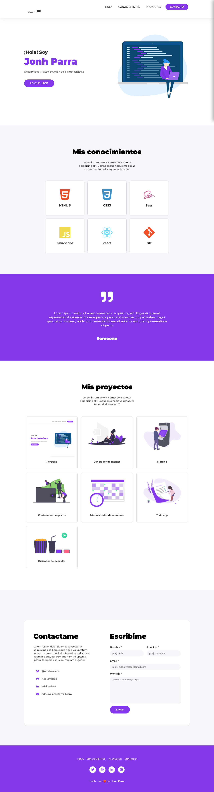

# Portafolio de Ada

### Este proyecto esta realizado para mostrar un ejemplo de como sería un portafolio para la entrega final del modulo-01 de Ada

  

 ***

### Si quieres ver como me quedo puedes darle click a este [enlace](jonhks.github.io/portafolio-ada/.) o puedes hacerlo desde [acá]()

 

***

### Si quieres tener el código en tu computadora, deberás de seguir estos pasos en tu terminal. 

  - Ir al [repositorio](https://github.com/Jonhks/portafolio-ada)  
  - darle click al botón de forkear
  - Darle click al botón de code
  - Copiar la url
  - Abrir tu terminal y poner el comando de **git clone <url>**
  - Entrar a la carpeta del proyecto y abrirlo en tu IDE. 

  ### Este proyecto no necesita la instalación de ninguna dependencia, por ahora! 

   

  *** 

  ### Este debería ser el resultado final de tu instalación

  

 

***

### Este portafolio fue desarrollado para las chicas de la cursada 6 de Ada, Agradezco a [Leydy](https://github.com/leydyk93/) la ayuda proporcionada!

 

***

#### De Jonh con 🧡 Para ustedes!

